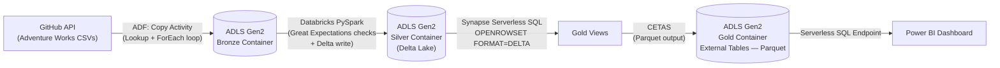

# Adventure Works — End-to-End Azure Data Engineering Pipeline

An end-to-end data engineering project built entirely on Azure, implementing a **Medallion (Bronze → Silver → Gold) architecture** with a metadata-driven ingestion pattern, Delta Lake for reliable storage, automated orchestration, and data quality gating. Raw Adventure Works data is pulled from a GitHub API source, transformed with Spark, served through a Lakehouse pattern in Synapse Serverless SQL, and visualized in Power BI.

## Architecture



**Flow summary:**
1. **Ingest (Bronze):** Azure Data Factory pulls raw CSVs from a GitHub-hosted source into ADLS Gen2, using both a static pipeline and a reusable, metadata-driven dynamic pipeline (Lookup + ForEach over a JSON config).
2. **Transform (Silver):** Azure Databricks reads Bronze data, validates it with Great Expectations, cleans/transforms it with PySpark, and writes it to ADLS Gen2 **in Delta Lake format**, authenticating via a Microsoft Entra ID app registration whose credentials are pulled from a Databricks secret scope (never hardcoded). This step runs automatically as part of the ADF pipeline via a Notebook activity on a job cluster.
3. **Serve (Gold):** Azure Synapse Analytics (Serverless SQL Pool) queries Silver Delta tables directly with `OPENROWSET(..., FORMAT = 'DELTA')`, builds curated Gold views, and materializes them as **Parquet** external tables via `CETAS` — Parquet because Synapse serverless SQL's CETAS command only supports Parquet/CSV as output formats, so this is the standard way to bridge a Delta source into a queryable, BI-friendly external table.
4. **Visualize:** Power BI connects to the Synapse Serverless SQL endpoint to build the final report.

## Tech Stack

| Layer | Service |
|---|---|
| Storage | Azure Data Lake Storage Gen2 (Delta Lake format in Silver) |
| Orchestration / Ingestion | Azure Data Factory |
| Transformation | Azure Databricks (PySpark, job cluster) |
| Data Quality | Great Expectations |
| Serving / Warehousing | Azure Synapse Analytics (Serverless SQL Pool) |
| Identity & Access | Microsoft Entra ID (App Registration + Databricks Secret Scope + Managed Identity) |
| Visualization | Power BI |

## Key Engineering Patterns Demonstrated

- **Metadata-driven pipeline** — a `Lookup` activity reads a `git.json` config file (source URLs + destination folder/filename per file) and feeds a `ForEach` loop that runs a single parameterized `Copy Data` activity for every source. Adding a new data source means adding a row to the config, not building a new pipeline.
- **Medallion architecture** — clear separation of raw (Bronze), cleaned + versioned (Silver, Delta), and business-ready (Gold) data.
- **Delta Lake in Silver** — ACID writes, and a foundation for time travel / incremental merge patterns, replacing plain Parquet.
- **Secretless notebook code** — Entra ID app credentials are stored in a Databricks secret scope and pulled at runtime with `dbutils.secrets.get()`; nothing sensitive is hardcoded or committed.
- **Automated orchestration** — ADF triggers the Databricks transform automatically after ingestion succeeds (Notebook activity, job cluster), so one pipeline run covers ingest → transform end-to-end.
- **Data quality gating** — Great Expectations checks run in the Silver notebook before each write; a failed check raises an exception, which fails the ADF activity and blocks bad data from ever reaching Gold.
- **Lakehouse pattern in Synapse** — `OPENROWSET(FORMAT='DELTA')` queries the current version of Silver data directly, no separate load step.
- **CETAS (Create External Table As Select)** — materializes Gold views as Parquet external tables (Delta isn't a supported CETAS output format), making them fast and stable for Power BI to query.
- **Least-privilege access** — Managed Identity (Synapse → storage) and scoped `Storage Blob Data Contributor` role assignments instead of shared account keys.

## Project Structure

```
adventureworks-azure-e2e-pipeline/
├── adf/
│   ├── pipelines/          # StaticPipeline.json, DynamicGitToRaw.json (includes Notebook activity)
│   ├── datasets/
│   ├── linkedServices/     # HTTP, ADLS Gen2, and Databricks linked services
│   └── config/
│       └── git.json        # metadata driving the dynamic pipeline
├── databricks/
│   └── notebooks/
│       └── silver_layer.py # Bronze -> Silver: GE validation + Delta write, secret-scope auth
├── synapse/
│   └── sql/
│       ├── 01_credentials_and_datasources.sql
│       ├── 02_gold_views_delta.sql       # OPENROWSET FORMAT='DELTA'
│       └── 03_external_tables_cetas.sql  # Parquet file format + CETAS
├── powerbi/
│   └── AdventureWorks_Dashboard.pbix
├── .github/
│   └── workflows/
│       ├── deploy-adf.yml
│       ├── deploy-databricks.yml
│       └── deploy-synapse-sql.yml
├── docs/
│   └── screenshots/
└── README.md
```

## Setup / Reproduce

1. **Provision infrastructure:** subscription → resource group → ADLS Gen2 storage account with `bronze`, `silver`, and `gold` containers.
2. **Deploy Azure Data Factory**, create the HTTP, ADLS Gen2, and Databricks linked services, then import the pipelines from `adf/pipelines/` and upload `git.json` to the config location referenced by the Lookup activity.
3. **Deploy Azure Databricks**, create a cluster, register a Microsoft Entra ID app for storage access, store its credentials in a Databricks secret scope, and let ADF trigger `databricks/notebooks/silver_layer.py` as part of the pipeline run (or run manually for testing).
4. **Deploy Azure Synapse Analytics**, grant its managed identity `Storage Blob Data Contributor` on the storage account, then run the scripts in `synapse/sql/` in order.
5. **Connect Power BI** to the Synapse Serverless SQL endpoint and build/refresh the report.

## Security Notes

This repo does **not** contain any credentials. Entra ID app secrets, storage account keys, and connection strings are supplied via a Databricks secret scope and Azure Key Vault / GitHub Secrets at deployment time — never committed to source control.

## CI/CD

Each layer deploys independently via GitHub Actions on push:
- **ADF** — Git-integrated via ADF Studio; publishing generates an ARM template on an `adf_publish` branch, deployed via `azure/arm-deploy`.
- **Databricks** — the Source-format notebook is deployed via the Databricks CLI (`databricks workspace import`).
- **Synapse SQL** — scripts in `synapse/sql/` run via `sqlcmd` against the Serverless SQL endpoint, written to be idempotent (`CREATE OR ALTER`, existence checks).

## Why This Design

- **Serverless over Dedicated SQL Pool:** querying the lake on-demand via `OPENROWSET`/external tables is significantly cheaper than loading everything into a dedicated database, while still giving a full SQL interface for BI tools.
- **Delta in Silver, Parquet in Gold:** Delta gives the transformation layer ACID guarantees and freshness; Parquet CETAS output gives the serving layer a stable, fast, BI-tool-friendly format — each layer uses the format best suited to its job, matching what Synapse serverless SQL actually supports at each stage.
- **Parameterized/dynamic ADF pipeline:** avoids building a separate pipeline per data source — new sources are onboarded by editing a config file.
- **Data quality gate before Silver write:** catches broken/missing source data early, before it can propagate into Gold and a Power BI report.

## Author

Zain Shafique
[GitHub](https://github.com/zshafique25) · Data Engineering / Analytics

## Future Improvements

- Incremental Delta `MERGE` in Silver instead of full overwrite, for true upsert behavior
- Delta time travel–based auditing/versioning views
- CI/CD test stage (schema/row-count assertions) before promoting to Gold
