# Adventure Works — Sales Performance Dashboard

A 4-page Power BI dashboard analyzing three years (2015–2017) of sales, returns, and customer data for Adventure Works, a fictional bike/accessories retailer. The dashboard covers overall sales performance, geographic distribution, product-level drill-down with price simulation, and customer segmentation.

**File:** `Dashboard.pbix`

---

## Data Model

The model follows a star-schema pattern with two fact tables and five lookup (dimension) tables, connected through 9 relationships:

| Fact Table   | Connects To                                                        |
| ------------ | ------------------------------------------------------------------ |
| Sales Data   | Customer Lookup, Product Lookup, Territory Lookup, Calendar Lookup |
| Returns Data | Product Lookup, Territory Lookup, Calendar Lookup                  |

Product Lookup further rolls up into Product Subcategories → Product Category.

**Data preparation (Power Query):**
- The three yearly sales files (2020, 2021, 2022) were appended into a single `Sales Data` table.
- `Customer Lookup` had 5 error rows and 1 null in the `CustomerKey` column. These were cleaned (type corrected to whole number, then filtered out), bringing the customer count from 18,154 down to a verified **18,148** rows.
- Power BI's auto-generated relationships were removed and replaced with 9 explicit relationships to ensure correct cardinality and filter direction.

**Calendar table** includes calculated columns for Year, Month, Day, Day of Week, Day Name, Month Name, Start of Week/Month/Quarter/Year, and a Weekend flag — enabling all the time-intelligence measures used across the report.

## Key DAX Measures

| Measure                                             | Logic                                                                                                |
| --------------------------------------------------- | ---------------------------------------------------------------------------------------------------- |
| Total Revenue                                       | `SUMX(Sales, OrderQuantity * ProductPrice)`                                                          |
| Total Cost                                          | `SUMX(Sales, OrderQuantity * ProductCost)`                                                           |
| Total Profit                                        | Total Revenue − Total Cost                                                                           |
| Total Orders                                        | `DISTINCTCOUNT(OrderNumber)`                                                                         |
| Return Rate                                         | Quantity Returned ÷ Quantity Sold                                                                    |
| Previous Month Revenue/Orders/Returns               | `CALCULATE(..., DATEADD(Calendar[Date], -1, MONTH))`                                                 |
| Order/Revenue/Profit Target                         | Previous month value × 1.1                                                                           |
| Total Customers                                     | `DISTINCTCOUNT(CustomerKey)`                                                                         |
| Average Revenue per Customer                        | Total Revenue ÷ Total Customers                                                                      |
| Adjusted Price / Adjusted Revenue / Adjusted Profit | Driven by a user-controlled **Price Adjustment (%)** numeric parameter, for what-if pricing analysis |

---

## Page 1 — Dashboard (Sales Overview)

Headline KPI cards, trending, and product performance at a glance.

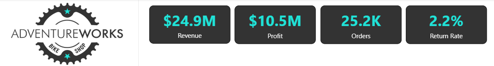

- **$24.9M** total revenue, **$10.5M** total profit, **25.2K** total orders, **2.2%** overall return rate across the three-year period.

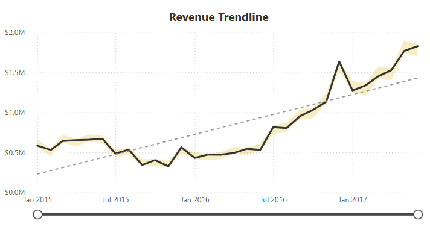

- Monthly revenue climbed from roughly $0.5M/month in early 2020 to a peak above $1.8M/month by mid-2022, with a built-in trend line and anomaly detection (90% sensitivity, explained by subcategory and country).

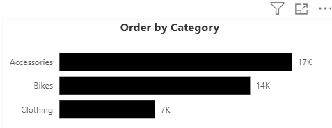

- Accessories lead order volume (17.0K), followed by Bikes (13.9K) and Clothing (7.0K) — Accessories drives volume, Bikes likely drives revenue given higher unit price.

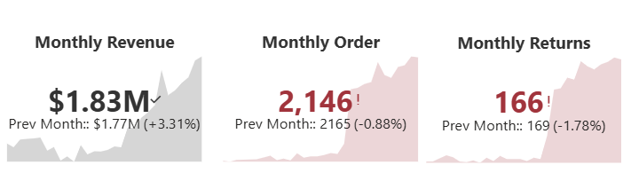

- Latest month: **$1.83M** revenue (+3.31% vs. prior month), **2,146** orders (‑0.88%), **166** returns (+1.78%) — revenue growing slightly faster than order count, and returns ticking up marginally.

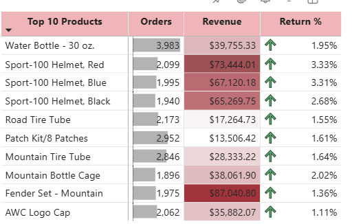

- The Water Bottle – 30 oz. is the volume leader (3,983 orders), but the Sport-100 Helmets (Red/Blue) carry the highest return rates (~3.3%), flagged via conditional-formatting background color.

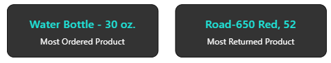

- **Tires and Tubes** is the most-ordered subcategory; **Shorts** is the most-returned — a useful pairing for inventory and quality-control conversations.

## Page 2 — Map (Geographic Performance)

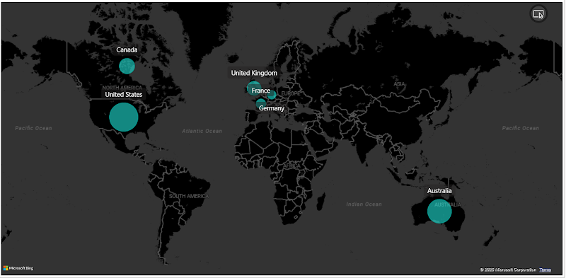

- Bubble size = total orders by country. The United States dominates order volume, with meaningful secondary markets in the UK, France, Germany, Canada, and Australia.

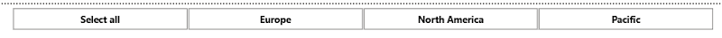

- A continent tile slicer (Europe / North America / Pacific) lets users filter the whole page by region.

## Page 3 — Product Details (Drill-through)

Right-click any product in the Page 1 matrix to drill through into a dedicated product scorecard.

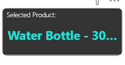

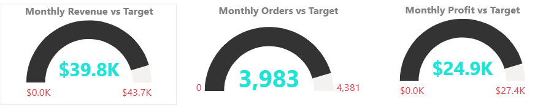

- Example — *All-Purpose Bike Stand*: 275 of a 293 order target (94%), $2,735 of a $2,827 revenue target (97%), $1,712 of a $1,770 profit target (97%). Targets are set dynamically at 110% of the prior month's actuals.

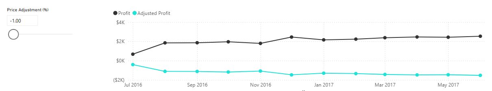

- An interactive **Price Adjustment (%)** slider (numeric parameter, -100% to +100%) recalculates an *Adjusted Profit* line against actual *Total Profit* in real time — a lightweight pricing what-if tool at the product level.

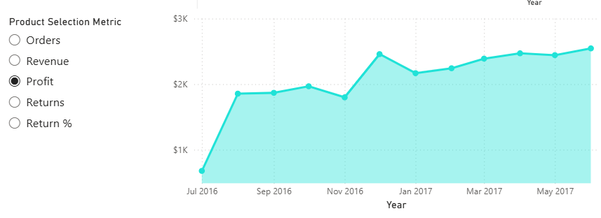

- A field parameter lets the user swap the area chart's metric between Orders, Revenue, Profit, Returns, and Return % without duplicating visuals.

## Page 4 — Customer Details

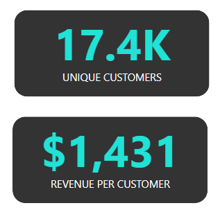

- **17.4K** unique customers generating **$1,431** average revenue per customer.

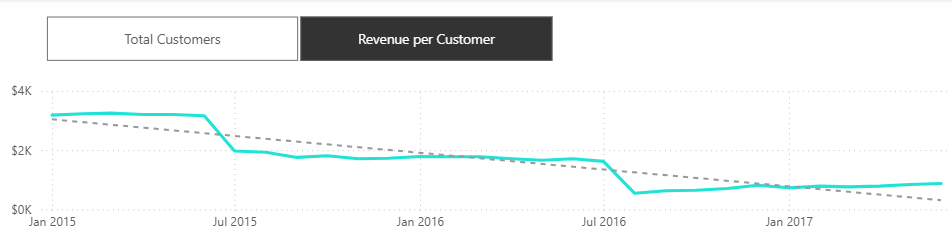

- Toggling to "Revenue per Customer" reveals a declining trend, from roughly $3.5K down to under $1K per customer between 2020 and 2022 — consistent with a rapidly growing customer base diluting average spend, worth flagging for retention/upsell strategy.

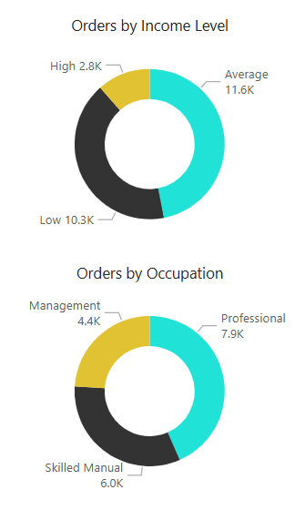

- By income level: Average-income customers place the most orders (11.6K), ahead of Low (10.3K) and High (2.8K).
- By occupation: Professional (7.9K) and Skilled Manual (6.0K) customers order the most, with Management trailing (4.4K).

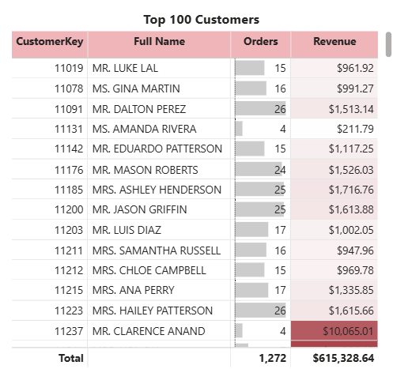

- The top 100 customers by revenue account for 1,733 orders and **$2,327,194** in revenue combined.

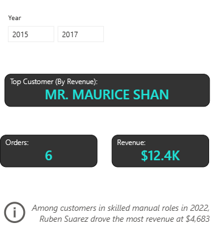

- A year slicer drives a "Top Customer by Revenue" card plus an auto-generated narrative (Power BI's Insert → Narrative / smart narrative visual) that surfaces context like the top revenue-driving customer within a selected segment and year.

---

## Interactivity Highlights

- **Drill-through:** Top 10 Products matrix → Product Details page, filtered by `ProductName`.
- **What-if parameter:** Price Adjustment (%) slider driving Adjusted Profit.
- **Field parameters:** swappable metrics on both the Product Details area chart and the Customer Details trend line, avoiding duplicate visuals.
- **Anomaly detection:** on the Revenue Trending line chart, explained by Subcategory and Country.
- **Smart narrative:** AI-generated text insight on the Customer Details page.
- **Slicers:** Year, Continent (tile slicer), all wired into a collapsible left-hand navigation bar consistent across pages.

## Tools Used

Power BI Desktop — Power Query (data cleaning & transformation), Data Modeling (star schema, relationships), DAX (measures & calculated columns), Report visuals (cards, matrix, map, gauges, line/area/bar charts, parameters, smart narrative).
